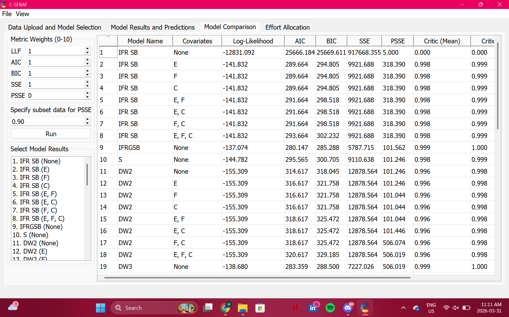
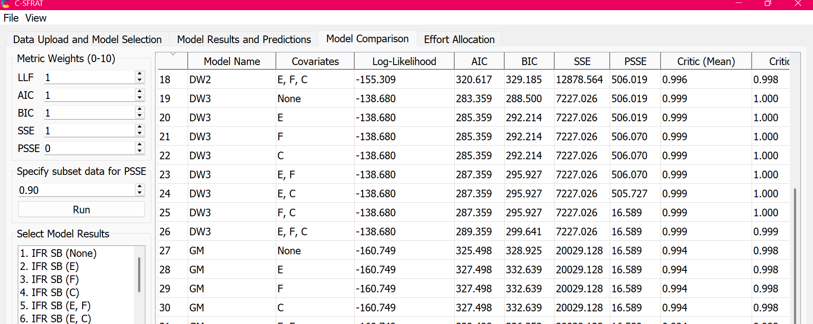
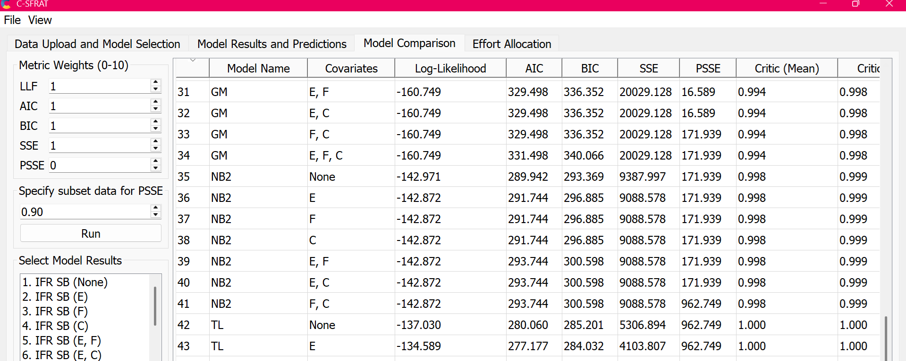
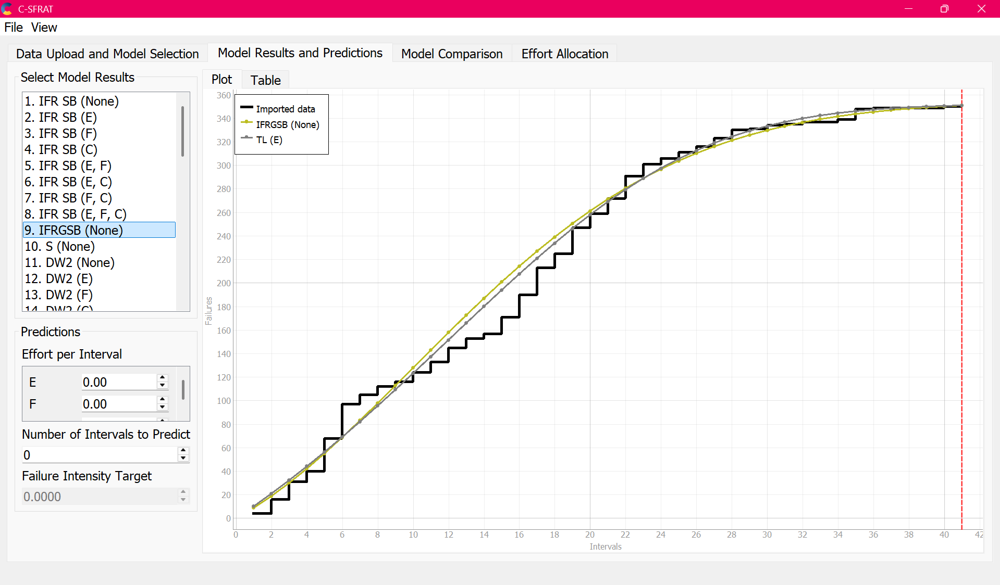
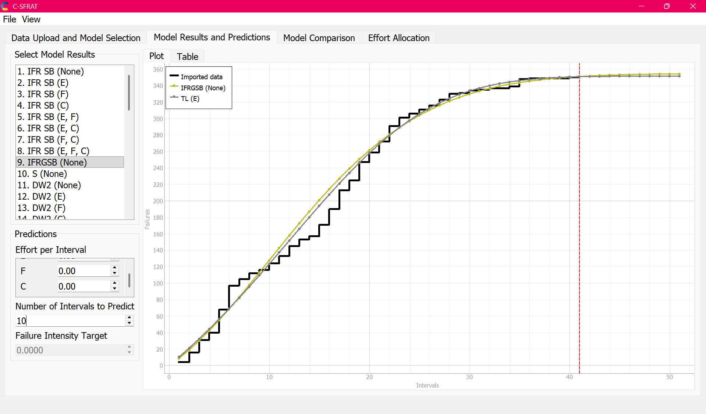
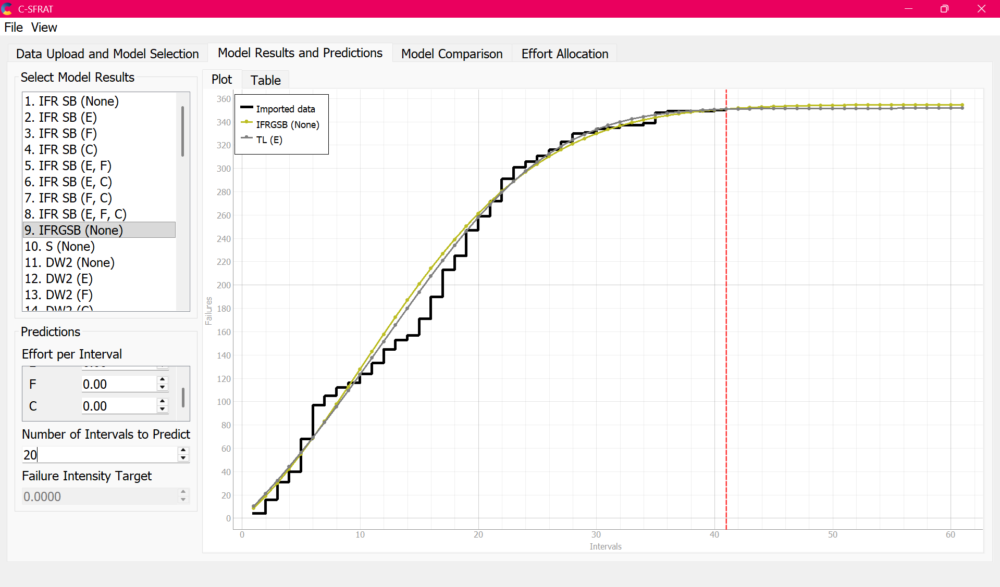
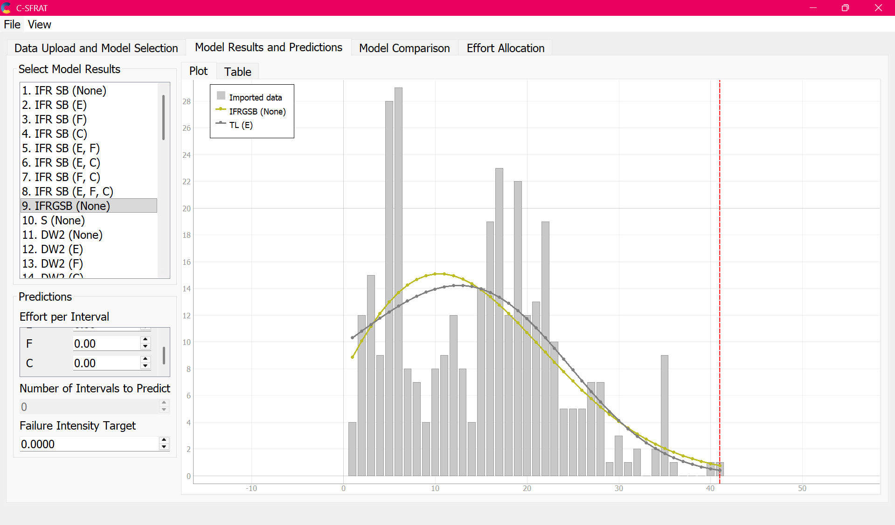
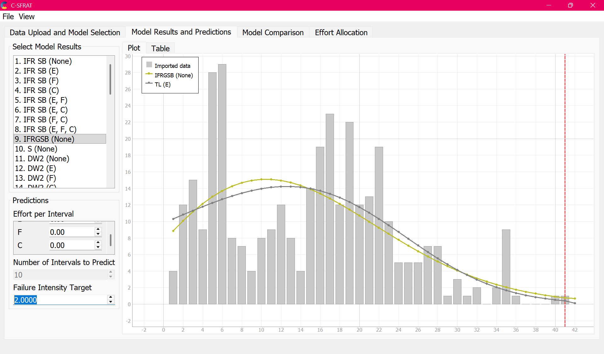

**SENG 438 - Software Testing, Reliability, and Quality**

**Lab. Report \#5 - Software Reliability Assessment**

| Group \#:              | 08 |
| ---------------------- | -- |
| Student Names:         |    |
| Yazin Abdul Majid      |    |
| Muhammad Zain          |    |
| Fateh Ali Syed Bukhari |    |

# Introduction

This assignment focuses on software reliability assessment using two complementary techniques: Reliability Growth Testing and Reliability Demonstration Chart (RDC). Reliability Growth Testing uses statistical models to analyze failure data over time, helping us understand how the system's reliability improves as defects are found and fixed. The RDC approach provides a visual, decision-oriented method for determining whether the system under test meets a target Mean Time To Failure (MTTF). Together, these techniques give a comprehensive view of a system's reliability from both a modeling and an acceptance-testing perspective.

For this assignment, we used C-SFRAT (Covariate Software Failure and Reliability Assessment Tool) for reliability growth testing in Part 1 and the RDC-11 Excel macro for the Reliability Demonstration Chart analysis in Part 2.

# Data Selection and Preparation

## Selected Dataset

For Part 1 (Reliability Growth Testing), we selected **J3.DAT** from the `Failure_Data_Set/Failure_Count/` directory. This dataset contains failure-count data measured in weekly intervals, with 41 time intervals and a total of 351 recorded failures. We chose this dataset because it has a sufficient number of intervals and failures to produce meaningful model fits, and it exhibits a clear reliability growth trend - the failure counts start high (peaking at 28-29 failures per week in intervals 5-6) and gradually decrease toward 0-1 failures per week by the end (intervals 37-41).

## Data Conversion for C-SFRAT

The J3.DAT file provides data in two columns: Time Interval (T) and Number of Failures (FC). However, C-SFRAT requires a CSV file with five columns: T, FC, E, F, and C - where E represents execution effort, F represents failure identification effort, and C represents computer-based effort.

Since the original dataset does not include effort data, we set E = F = C = 1 for all intervals (constant effort per interval). This is a reasonable assumption given that each interval represents one week of testing under presumably consistent conditions.

The final processed CSV used as input to C-SFRAT:

```
T,FC,E,F,C
1,4,1,1,1
2,12,1,1,1
3,15,1,1,1
4,9,1,1,1
5,28,1,1,1
6,29,1,1,1
7,8,1,1,1
8,7,1,1,1
9,4,1,1,1
10,8,1,1,1
11,9,1,1,1
12,12,1,1,1
13,8,1,1,1
14,4,1,1,1
15,14,1,1,1
16,19,1,1,1
17,23,1,1,1
18,12,1,1,1
19,22,1,1,1
20,12,1,1,1
21,13,1,1,1
22,19,1,1,1
23,10,1,1,1
24,5,1,1,1
25,5,1,1,1
26,5,1,1,1
27,7,1,1,1
28,7,1,1,1
29,1,1,1,1
30,3,1,1,1
31,1,1,1,1
32,2,1,1,1
33,0,1,1,1
34,2,1,1,1
35,9,1,1,1
36,1,1,1,1
37,0,1,1,1
38,0,1,1,1
39,0,1,1,1
40,1,1,1,1
41,1,1,1,1
```

**Assumptions:**
- Each time interval corresponds to one week of testing.
- Effort variables (E, F, C) are not provided in the raw data and are assumed to be constant at 1 per interval.
- Only failure count data is used; severity and description fields are not considered.

# Assessment Using Reliability Growth Testing

## Model Comparison and Top Two Models

We loaded the processed J3 CSV into C-SFRAT and ran all available hazard functions (IFR Salvia & Bollinger, IFR Generalized Salvia & Bollinger, S Distribution, Discrete Weibull Order 2, Discrete Weibull Order 3, Geometric, Negative Binomial Order 2, and Truncated Logistic) with all covariate combinations (None, E, F, C, E-F, E-C, F-C, E-F-C). This produced 49 model-covariate combinations in total.

The Model Comparison table below shows the results for all models, ranked by key metrics including Log-Likelihood, AIC (Akaike Information Criterion), and BIC (Bayesian Information Criterion).







To select the top two models, we compared models based on the following criteria:
- **Log-Likelihood**: Higher (closer to 0) is better, indicating the model fits the observed data more closely.
- **AIC**: Lower is better, balancing model fit against complexity.
- **BIC**: Lower is better, with a stronger penalty for additional parameters than AIC.

We excluded Row 1 (IFR SB with no covariates) as it clearly failed to converge, evidenced by its extremely large AIC of 25666 and SSE of 917668.

**Top Two Models Selected:**

| Rank | Model | Covariates | Log-Likelihood | AIC | BIC |
|------|-------|-----------|----------------|-----|-----|
| 1 | TL (Truncated Logistic) | E | -134.589 | 277.177 | 284.032 |
| 2 | IFRGSB (IFR Generalized Salvia & Bollinger) | None | -137.074 | 280.147 | 285.288 |

The **Truncated Logistic model with covariate E** achieved the best fit with the lowest AIC (277.177) and highest log-likelihood (-134.589). The **IFR Generalized Salvia & Bollinger model with no covariates** was the second-best, with an AIC of 280.147 and log-likelihood of -137.074. Both models demonstrated strong predictive performance with Critic (Mean) values of 1.000, indicating excellent goodness-of-fit.

## Range Analysis

Not all portions of the failure data are equally useful for reliability growth modeling. The range analysis involves determining which part of the dataset is most suitable for fitting reliability growth models.

Looking at the J3.DAT data, we can identify three distinct phases:

- **Intervals 1-6 (Early phase):** The failure rate is highly variable and rising, peaking at 28-29 failures per week. This initial period reflects the early integration testing phase where many defects are being discovered. The high variability makes this region less stable for model fitting.
- **Intervals 7-23 (Middle phase):** The failure rate fluctuates but shows a general downward trend from the peak. This transitional region contains useful data showing the beginning of reliability growth.
- **Intervals 24-41 (Late phase):** The failure rate drops significantly and stabilizes at low values (0-2 failures per week), with a brief spike at interval 35 (9 failures). This region most clearly demonstrates reliability growth.

For our analysis, we used the **full dataset (intervals 1-41)** because both selected models (TL and IFRGSB) were able to capture the overall S-shaped cumulative failure curve effectively. The C-SFRAT subset slider was kept at 41 (maximum). Using the full range allows the models to capture both the initial high-failure period and the later stabilization, providing a complete picture of the system's reliability growth trajectory.

## Plots for Failure Rate and Reliability

### Cumulative Failures (MVF) Plot - No Predictions

The following plot shows the Mean Value Function (cumulative failures over time) for both top models overlaid on the imported data with no future predictions:



Both the IFRGSB (yellow) and TL (grey) model curves closely follow the actual cumulative failure data (black staircase). The S-shaped curve indicates classic reliability growth behavior - rapid failure accumulation early on, followed by a gradual flattening as defects are resolved and fewer new failures occur.

### Cumulative Failures (MVF) Plot - 10 Predicted Intervals



With 10 additional predicted intervals (weeks 42-51), both models predict that cumulative failures will plateau around 355-360 total failures. The curves flatten significantly beyond interval 41, suggesting the system is approaching a stable state where very few new failures are expected.

### Cumulative Failures (MVF) Plot - 20 Predicted Intervals



Extending predictions to 20 additional intervals (weeks 42-61) confirms the plateau behavior. Both models converge to approximately 360 total failures, with virtually no new failures predicted beyond week 50. This suggests the system has reached (or is very close to reaching) its maximum expected number of defects.

### Failure Intensity Plot

The intensity plot shows the failure rate per interval (failures per week) rather than cumulative failures:



The bar chart represents the actual failure counts per interval, while the model curves show the fitted intensity functions. Both models capture the overall trend: the failure intensity rises to a peak around intervals 8-15 (approximately 13-15 failures per week according to the models), then steadily decreases toward 0. The actual data is more variable than the smooth model curves, which is expected since the models represent the underlying trend rather than individual fluctuations.

### Failure Intensity Plot with Predictions and Target



With 10 predicted intervals and a failure intensity target of 2.0 failures per week, we can observe that both model curves drop below the target rate around intervals 30-33. The predicted intensity continues to decrease in the forecast period, reaching well below 1 failure per week by interval 50.

## Decision Making Given a Target Failure Rate

Setting a target failure rate is critical for deciding when testing can be considered sufficient. Based on our analysis:

- If the target failure rate is **2 failures per week**, the system achieves this target around interval 30-33 according to both models. This means by approximately week 30 of testing, the system's failure rate has dropped below the acceptable threshold.
- If a more aggressive target of **1 failure per week** is desired, the system reaches this around interval 36-38, very close to the end of the observed testing period.
- Both models predict the intensity will continue dropping well below 1 failure per week in the predicted intervals (41-51), reinforcing confidence that the system is becoming increasingly reliable.

The implication is that if the organization's acceptable failure rate is 2 failures per week, then testing could have been considered adequate around week 30-33. However, continued testing through week 41 has brought the failure rate down further, providing additional confidence in the system's reliability.

## Advantages and Disadvantages of Reliability Growth Analysis

**Advantages:**
- Provides quantitative, model-based predictions of future failure behavior, allowing teams to estimate when a target reliability level will be achieved.
- Multiple models can be compared using statistical criteria (AIC, BIC, log-likelihood) to find the best fit for a given dataset, reducing subjective bias.
- Enables "what-if" analysis by predicting how many additional testing intervals are needed to reach a desired failure rate.
- Captures the overall trend in failure data, smoothing out noise and random variation to reveal the underlying reliability improvement.

**Disadvantages:**
- Requires sufficient failure data to produce meaningful results - too few data points can lead to poor model fits or unreliable predictions.
- The choice of model can significantly affect predictions, and there is no guarantee that any model perfectly represents the true failure process.
- Effort variables (E, F, C) are often unavailable in practice and must be assumed, which introduces uncertainty into the analysis.
- Models assume that the testing process and environment remain relatively consistent over time, which may not always hold true in real projects.
- The analysis is retrospective - it works best for assessing past testing data and may not account for sudden changes in the software (e.g., major refactors or new feature additions).

# Assessment Using Reliability Demonstration Chart

*(To be completed in Part 2)*

# Advantages and Disadvantages of Reliability Demonstration Chart

*(To be completed in Part 2)*

# Comparison of Results

*(To be completed after Part 2)*

# Discussion on Similarity and Differences of the Two Techniques

*(To be completed after Part 2)*

# How the team work/effort was divided and managed

*(To be completed)*

# Difficulties encountered, challenges overcome, and lessons learned

*(To be completed)*

# Comments/feedback on the lab itself

*(To be completed)*
